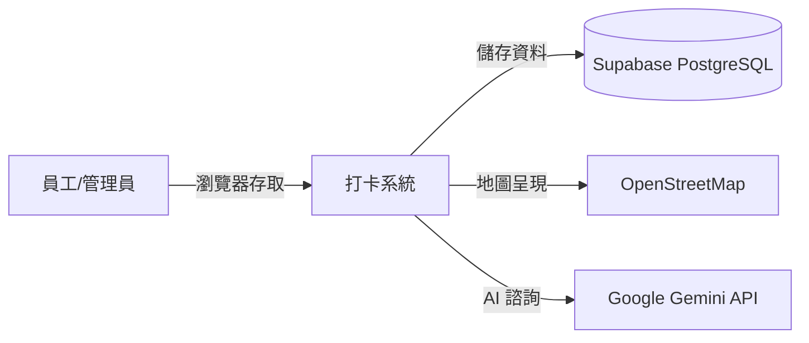

# 03. 系統範疇與情境

## 3.1 商業情境
下圖展示了系統使用者、本系統以及外部服務之間的關係：

## 3.2 技術情境
- **使用者端**：現代瀏覽器（支援 HTML5/JS）。
- **外部串接**：
    - **Supabase**：儲存所有使用者、打卡、假單資料。
    - **OpenStreetMap (Leaflet)**：前端顯示打卡地圖位置。
    - **Gemini API**：後端處理 RAG (Retrieval-Augmented Generation) 諮詢請求。
    - **Render**：提供運行 Python 環境的主機伺服器。
