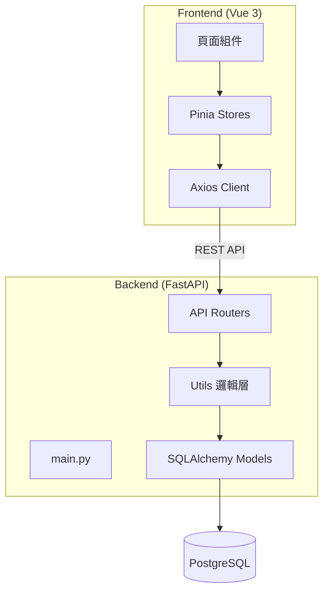

# 05. 建構區塊視圖

## 5.1 整體系統分解 (Level 1)

## 5.2 建構區塊說明

### 5.2.1 後端核心模組
- **app.main**：應用程式進入點，負責註冊路由與靜態資源掛載。
- **app.routers**：
    - `auth.py`：處理註冊、登入邏輯。
    - `attendance.py`：處理每日打卡動作（上班、下班、午休）。
    - `leave.py`：處理請假申請、審核及額度扣除。
    - `chat.py`：串接 Gemini API 提供對話服務。
- **app.models**：定義 User, Attendance, LeaveRequest 等資料庫模型。

### 5.2.2 前端核心組件
- **AuthView**：登入頁。
- **HomeView**：主控台與打卡按鈕。
- **LeaveView**：請假申請單與清單。
- **StatsView**：出勤統計圖表/清單。
- **StaffView**：員工名冊（經理級以上可見）。
