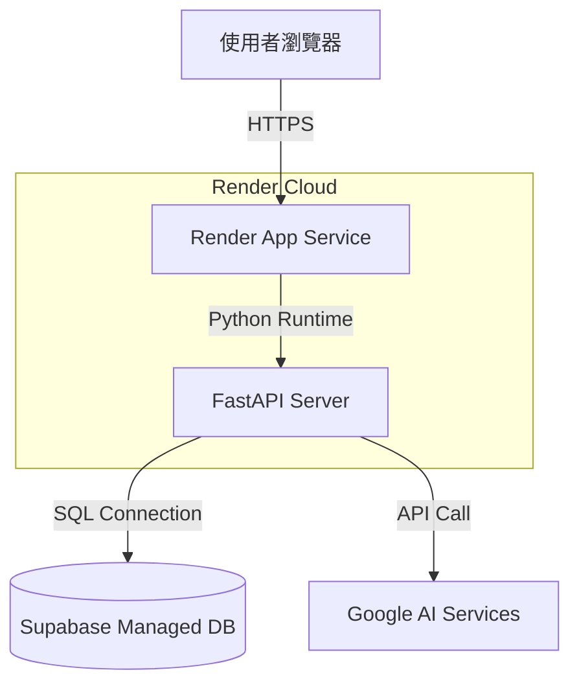
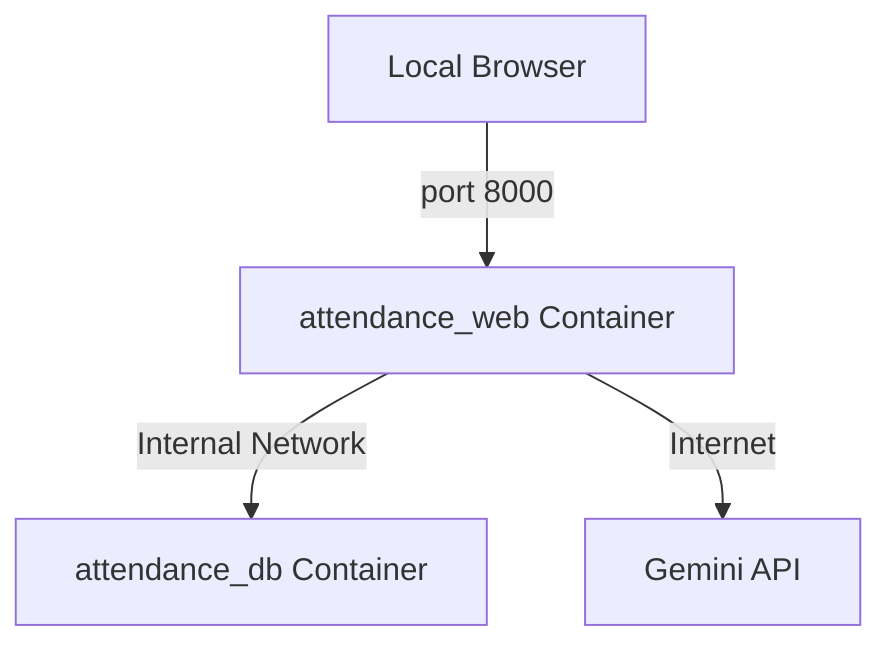

# 07. 部署視圖

## 7.1 生產環境 (Render + Supabase)

## 7.2 開發環境 (Local Docker)

## 7.3 基礎架構說明
- **Render**：自動執行 Dockerfile 建置，暴露 8000 端口（對外映射為 443）。
- **Supabase**：提供穩定且具備備份機制的 PostgreSQL。
- **Docker Compose**：
    - `web` 服務：基於專案目錄下的 `Dockerfile` 建置。
    - `db` 服務：使用 `postgres:15` 鏡像。
